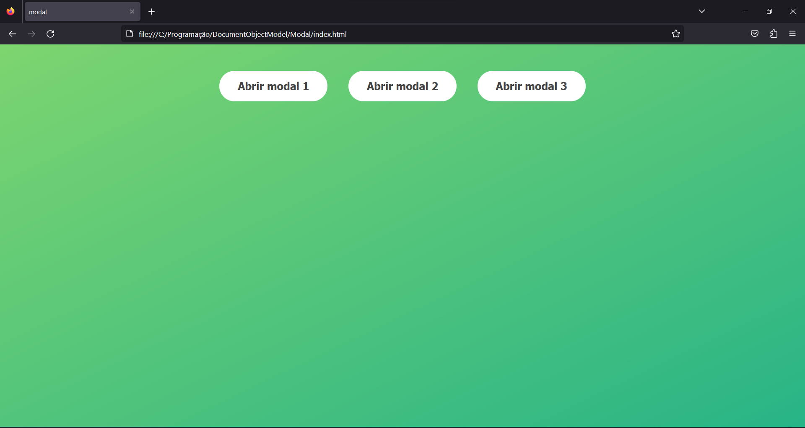
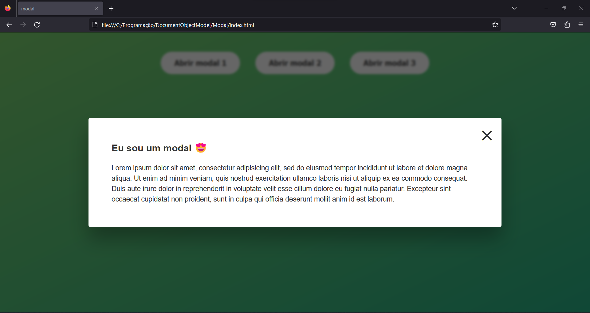

# DocumentObjectModel-Modal

Projeto simples que consiste na manipulação da DOM para controlar o estado de um modal - Escrito de forma imperativa.

## Tecnologias
* HTML
* CSS
* TypeScript

### Quick Start
* Baixar o repositório
* Descompactar a pasta
* Copiar o caminho do index.html e colocar na URL do navegador
* Caso queira alterar, certifique-se que tenha uma versão do Node instalada, caso não tenha: https://nodejs.org/en/
  * Tenha o TypeScript baixado globalmente, caso não tenha: `npm install -g typescript`
* Dentro de **./src** comece a modificar o arquivo index.ts e transforme o código em JS. No terminal, digite: `tsc` ou `tsc -w` para atualizar automaticamente

Se caso houver algum erro no terminal relacionado a políticas de segurança, execute os comandos no CMD ou no próprio PowerShell com os comandos seguidos de 
".cmd" - 
```
tsc.cmd -w
```

### File Tree
```
.
├── public/
│   ├── css/
│   │   └── style.css
│   └── js/
│       └── script.js
├── src/
│   └── index.ts
├── .prettierrc
├── index.html
└── tsconfig.json
```



